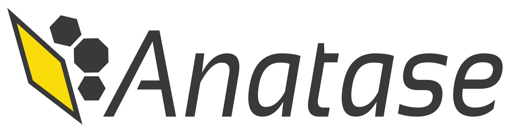
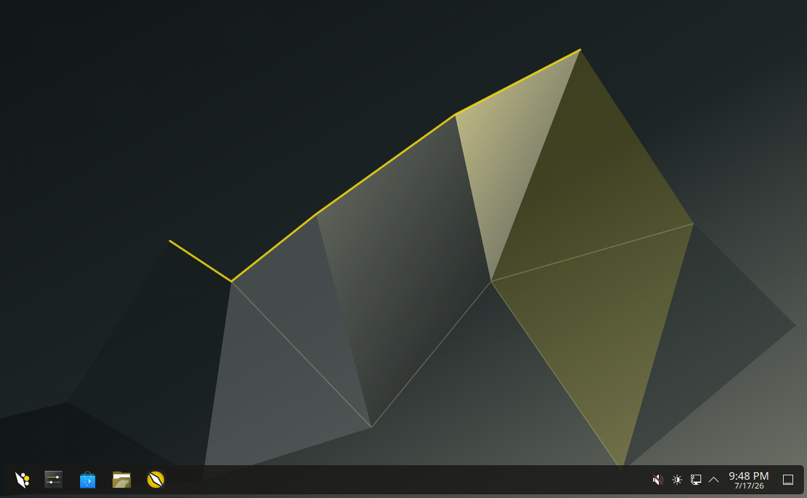
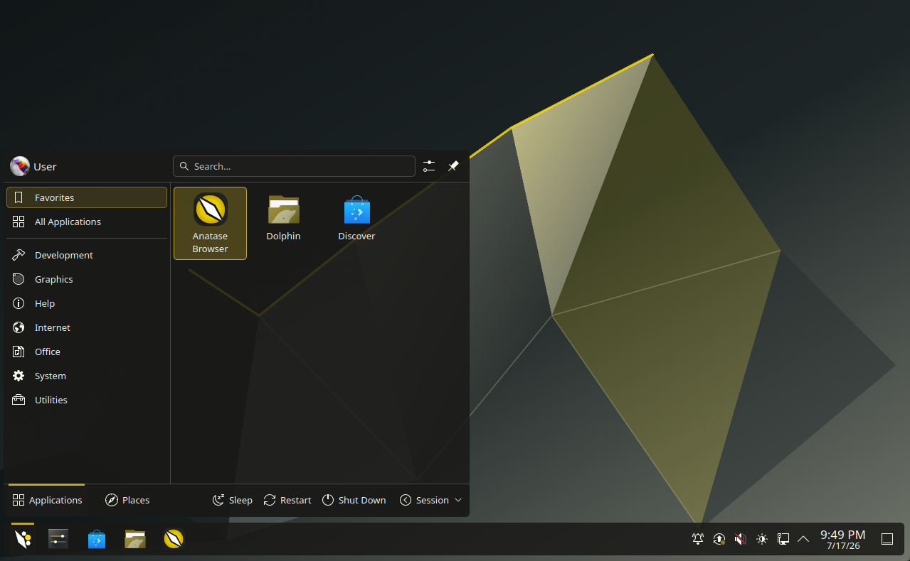
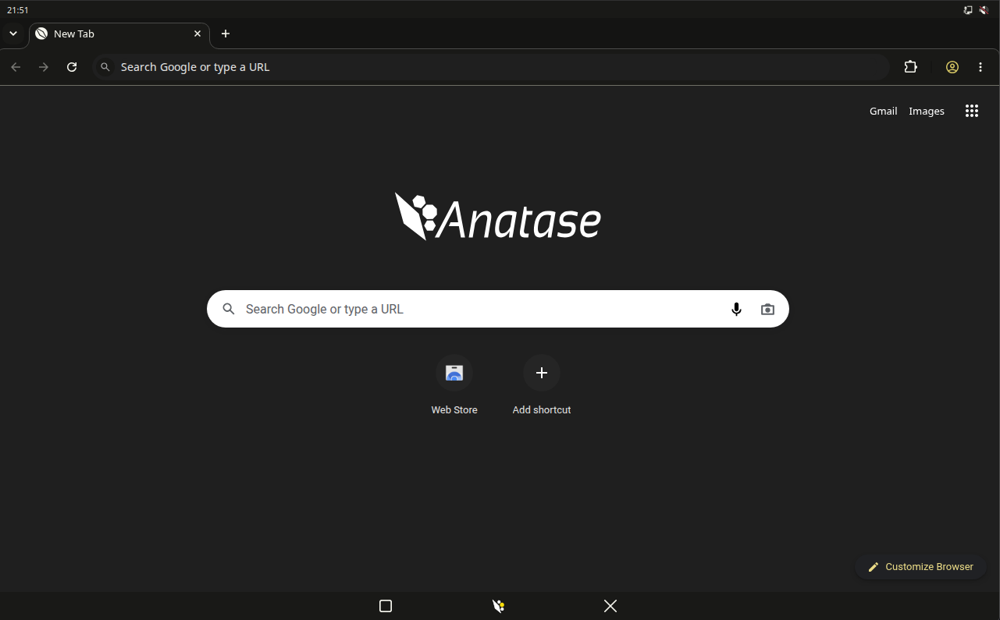
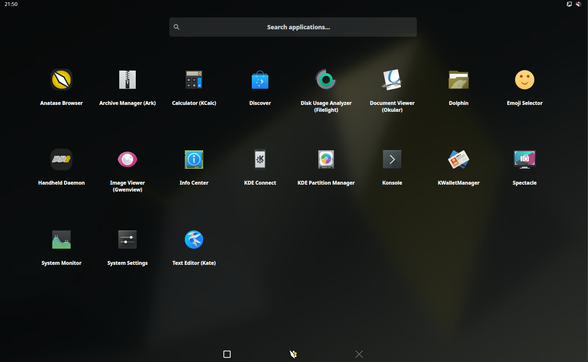
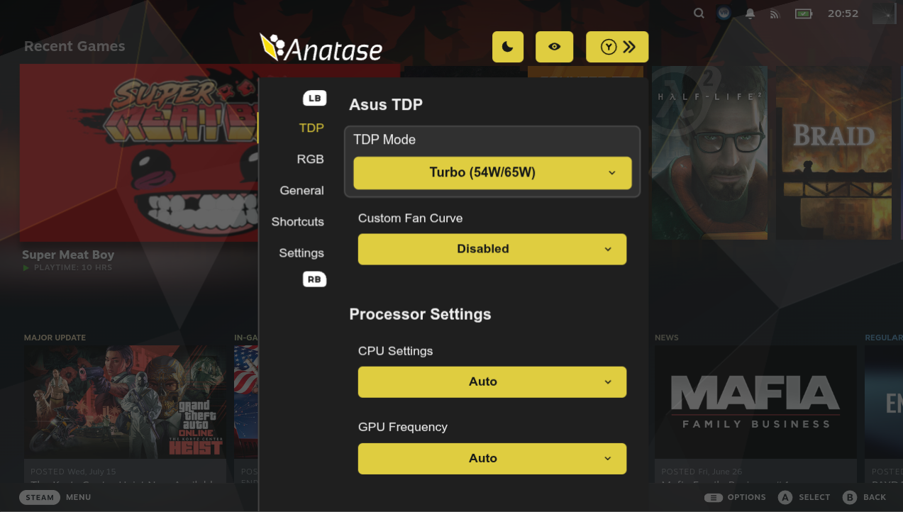
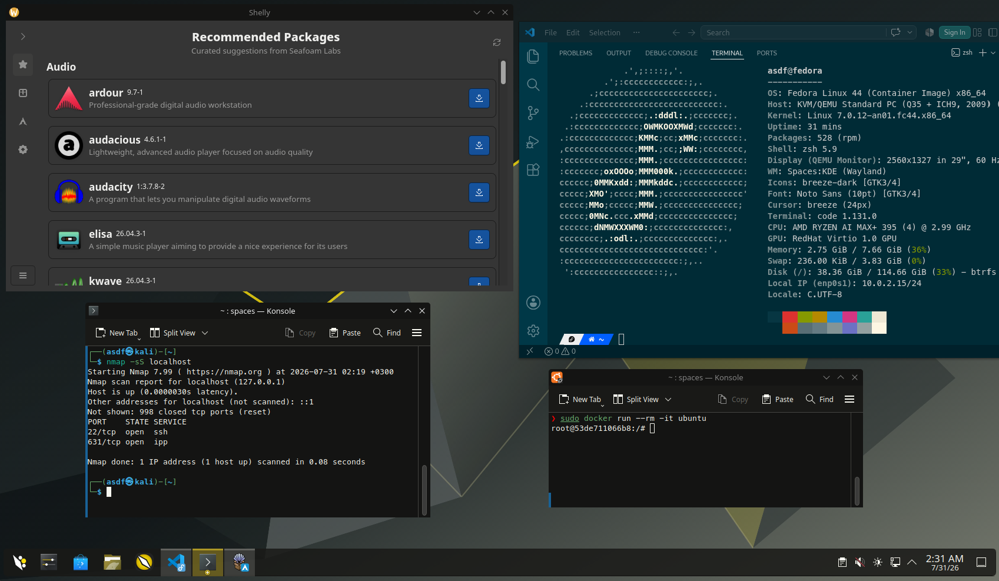

  <picture>
    <source
      media="(prefers-color-scheme: dark)"
      srcset="cards/base/identity/letterhead-onblack.svg">
    <source
      media="(prefers-color-scheme: light)"
      srcset="cards/base/identity/letterhead-onwhite.svg">
    
  </picture>

# Anatase

Anatase is a second generation immutable image. Rewritten from scratch, it distills three years of learnings from Bazzite to form an image that is more secure, more maintainable, and more stable, while fixing compliance / security issues.

From a user perspective, perhaps at first glance these do not mean much. So, let's boil it down to three axes.

 - **Smaller, more stable, and universal**. There is only one image to cover all handhelds, desktops, laptops, HTPCs, Nvidia devices*. The ISO is 2x smaller, the image is 2x smaller, and they both install / update much faster without functionality loss**. The ISO preinstalls a small set of (removable) applications, so you can open your PDFs and watch Youtube out of the box.
 - **Compliance, Security, Provenance**. Packages are either sourced from Fedora or built in this repository, ensuring fixes can be built in less than an hour, and no random changes are applied (important for both security and bugs).
 - **New Features**: All this allows for new exciting features, such as Spaces, a way to run multiple distributions at the same time, and universal **2X frame generation** in Gamemode for all games.

The end result is an OS built to get out of your way. There are games to play, reels to doomscroll, and homework to do. Install it and browse, game, while installing your favorite apps. Your **PDFs open**, **Spotify works**, **tested recent drivers/kernel are installed for games and AI workloads**, and your new fancy handheld **has controller and TDP support**.

*And a placeholder for a second future ARM one.

**Compared to bazzite-deck-nvidia, the closest image with matching functionality as of 15/07/2026

## Installation

Grab the ISO from [here](https://downloads.anatase.org/iso/anatase.iso), then:
 - In Windows, use Rufus or Balena Etcher
 - In Anatase/Linux, ISO Image Writer
 - or your Ventoy USB

Then, plug it in to your computer and start it. Installation is simple.

 - If you want to use encryption, specify a password during the encryption step. It is not possible to encrypt after installation.
 - If you want to dualboot, select the option to share your disk and how much space you want to use. Anatase will automatically configure the bootloader so that CMOS wipes do not forget Anatase.

> [!WARNING]
> NVIDIA GPUs from GTX 1000 generation and older (such as GTX 1080) are not currently supported.

> [!WARNING]
> Anatase has recently gone public. Please be patient and report any issues you find. In 1-3 months, it should be stable for daily use as 90% of the fixes that were developed on Bazzite, well, by the main author here, are ported already. But during the refactoring, some things might have been missed.

### Secure boot

If you wish to keep secure boot enabled, you will be faced with:

 - **Verification failed: (0x1A) Security Violation:** Press Enter for OK
 - **Press Any Key to perform MOK Management:** Press Enter
 - Select **Enroll key from disk** -> **ANATASE_KEY** -> **ANATASE-KEY-ENROLLME.der**
 - If you select **View key 0**, the fingerprint is **6A:18:4E:3F:50:82:6A:C2:C8:A8:65:CA:BD:D1:CD:8F:16:0A:4E:8D**
 - **Continue** -> **Enroll Key: Yes** -> **Reboot**

After power failures, or your battery draining to 0, you might face the same screen. In this case, follow the same steps, where in this case **ANATASE_KEY** becomes **ANATASE_EFI**. Anatase automatically keeps a copy of its key in your disk in case this happens 😉

These steps will become unnecessary once Anatase gets secureboot keys. Want that to happen sooner? **Share Anatase with your friends!**

## Overview
> [!TIP]
> Anatase uses three sessions. You can switch between them on the login screen, by opening the drop-down on the bottom left of the screen.
>
> To select a default one, in desktop mode **Settings** -> **Login Screen** -> **Automatically Log in ✔️ as user:** your user -> **with session:** your session
> 
> **Do not tick "Login again immediately after logging off" or you will get stuck in Gamemode**

### Plasma Desktop
Anatase uses KDE Plasma as for its desktop. It is performant, _feels_ like Windows, and is progressing rapidly with a core team of competent developers. Anatase preinstalls Ark (Archive Manager), Filelight (Disk Usage Analyzer), Kate (Text Editor), and Okular (Document Viewer), which come from KDE, so you can do basic tasks out of the box.

### Plasma Mobile
Anatase also offers Plasma Mobile for tablet-like devices, such as handhelds and two-in-ones (Asus Z13). While Plasma Mobile is still in its early days, it already feels great to use, and for its 20MB install size, it delivers a punch and is great for use in e.g., flights.

Also shown, the Anatase Browser. A Chromium based browser with **working GPU acceleration**, **support for Spotify & 720p Netflix**, and **a built-in adblocker** that works great and updates with the system**. _Yes, having working GPU acceleration is a big deal in Linux._

**Adblocker is based on UBOLite, a completely offline adblocker, and can be rebuilt on demand if the filter lists become outdated without delays from Chrome Store approval and delivered as a signed Flatpak.

### Gamemode
Anatase also has a Gamemode that brings in elements from SteamOS as an optional addon. Compared to gaming in Plasma Desktop:

 * Gamemode is intuitive to touch
 * It uses less RAM than a Desktop session
 * Brings the game closer to the GPU, with advanced controls for VRR, Framerate, and HDR. 
 * New in Anatase: **Frame Generation (2X)**. After enabled, games are rendered at half of your target FPS and the other half is generated. Works in all games and with all anticheat!
 * Compared to SteamOS and Bazzite, it gets out of your way. There are proper lock and login screens so you can use this for your desktop or have multiple users, while also being able to set it to autolaunch on boot.

### Access the Linux world with Spaces
You have your Linux preferences, you like specific distributions and their packages, or maybe you want to experiment and see what's the best one: Arch, Fedora, or Ubuntu? In Anatase, you do not have to choose. By typing `arch`, `fedora`, `ubuntu`, or `kali` in your terminal, it transforms to that distribution and gives you access to all its packages, both terminal and desktop ones.

Everything is supported: Docker, VMs, browsers, Visual Studio code, hacking tools, partition managers, package managers, Tailscale, even snap. They integrate seamlessly with your desktop, supporting conveniences such as screen sharing, systemd services, and even your sudo password. Applications **appear in your task bar** as you install them.

A permission system ensures you share only what you need: only your Downloads folder is shared by default, security devices such as USB Crypto wallets are blocked, and SELinux enforcement ensures your SSH and GPG keys remain safe. As attacks on Linux become more common, this provides a security boundary* to keep your system safe while accessing repositories such as the AUR.

Below, you can see an Anatase system running the Shelly AUR package manager from Arch, Visual Studio Code in Fedora, nmap in Kali Linux, and Docker in Ubuntu, all at the same time! Even better, there is no performance overhead. Develop your way, just the way you are used to.

And if you blow up the Space, because perhaps you [typed "Yes, do as I say!"](https://www.youtube.com/watch?v=siEIKFy1Q0I) or your agent decided to fix a problem [through unconventional means](https://www.theregister.com/ai-and-ml/2026/07/16/openai-admits-gpt-56-occasionally-deletes-files-but-its-an-honest-mistake/5274008), `spaces create <space>` will recreate it and you will be back to developing in 5 minutes. Your home is separate, with a Space accessing only the folders you choose to share, limiting the potential damage.

Finally, you can `claude --dangerously-skip-permissions` and go to the bathroom in peace. Go ahead, install 50 AUR packages with 3 crypto miners*. It's ok if it breaks, your system will be fine. More information [here](https://github.com/anatase-org/spaces).

*Spaces has not undergone a formal security review, so installing malware is unwise.

## Roadmap
 * Fix remaining bugs through user reports to achieve a stable release
 * Add CEC support for gamemode only
     * on startup or wake-up, if a TV is connected:
       * if off, turn it on and switch to output
       * if on other channel, switch to gamemode output
     * when entering sleep or shutdown
       * if the tv was turned on, turn it off
       * if the channel was switched, switch to the previous channel
       * on other cases, do nothing
     * allow the tv remote to navigate the interface via up/down/left/right/ok and back
     * if possible and intuitive, enable controlling the TV / soundbar audio
 * Achieve SLSA3
   * Port github attestations and use them verify CI images end-to-end
   * Add SBOM support using a custom metadata format to record transient changes (new fedora packages, git+ repo pulls)
 * Build an arm image
   * Begin with one handheld: Pocket Retroid 6, as it supports UEFI compatible booting from SD card without invasive changes
   * Test on one UEFI ARM device (DGX Spark or laptop)
   * Expand device coverage
 * Expand kernel to support TPM attestation for hibernation and initramfs verification
   * Hibernation is currently forcibly disabled when secure boot is enabled to comply with secure boot requirements
   * Use a TPM Policy from the current kernel to HMAC verify the hibernation image and block kernel takeovers
   * The initramfs is not currently verified. Automatic unlock of encrypted hard disks through the TPM can be bypassed
   * Sign the initramfs with an attached signature. Make the kernel extend an unused PCR depending on initramfs status, use that PCR as part of unlock policy and re-extend the PCR when exiting the initramfs
 * In the future, apply for Secureboot

## Contributing

Anatase does not currently accept external contributions. You are welcome to post issues in the issue tracker, with suggestions or bug reports.

## License

A copy of the files in this repository is provided to you under the terms of [GNU Affero General Public License v3.0 or later](LICENSE). Exceptions: `.patch` files carry the license of their respective project solely and files with an SDPX license header carry that license solely.

You may reuse the Anatase mark when producing derived images or rehosting unmodified images that are for personal or internal organizational use. Otherwise, [fork](https://github.com/anatase-org/anatase/fork) Anatase and replace the identity card with your type and marks.

**Non-legally binding TLDR:** Anatase is free software and under the terms of AGPLv3, you may freely adapt the software for your or your organization's (internal) needs without publishing your changes. The same applies to the mark. An example of internal use is your IT department installing Anatase on your laptop or you putting it on your son's laptop.

Anatase is not currently at the stage where it can be pre-installed on devices.
